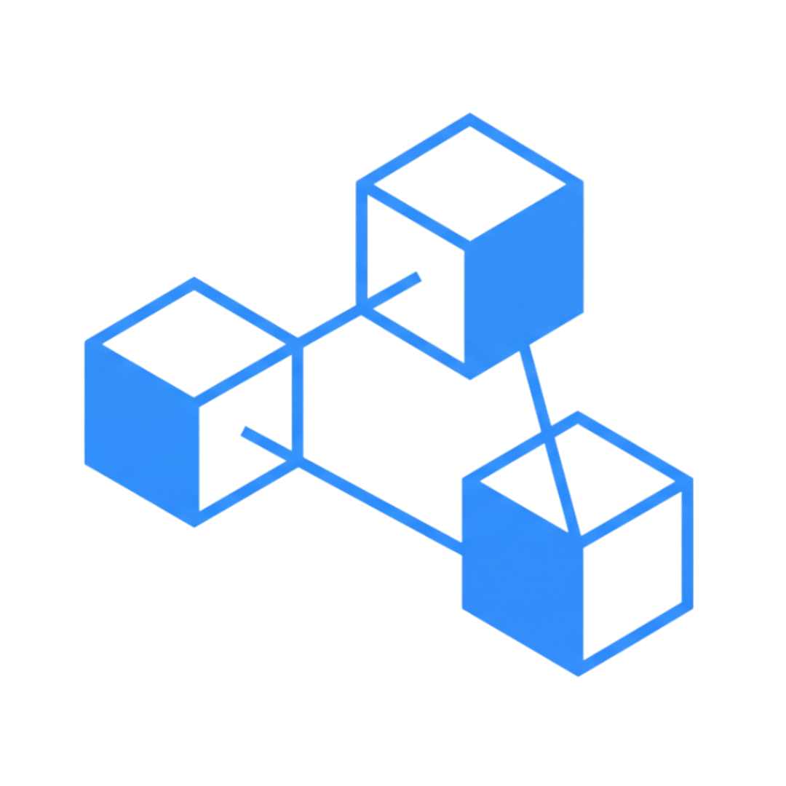
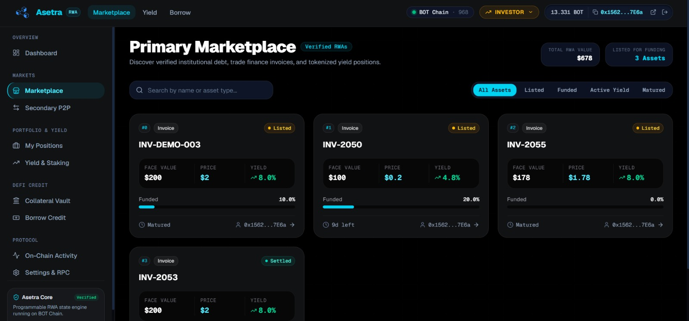
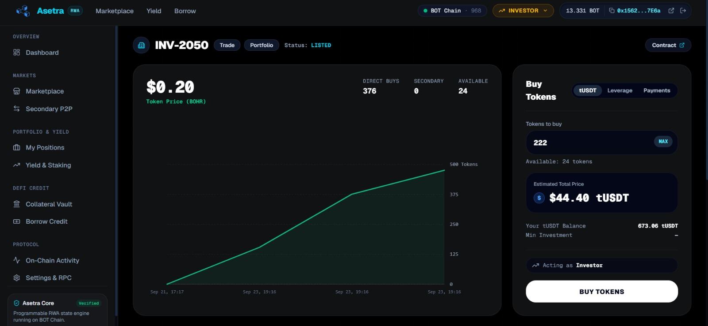
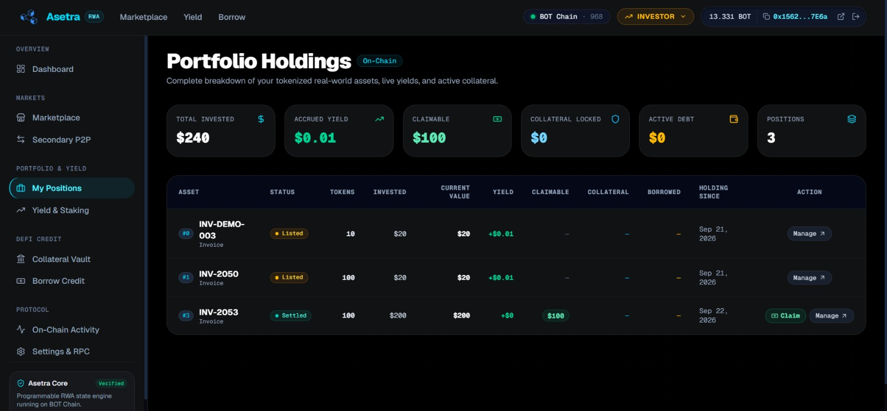
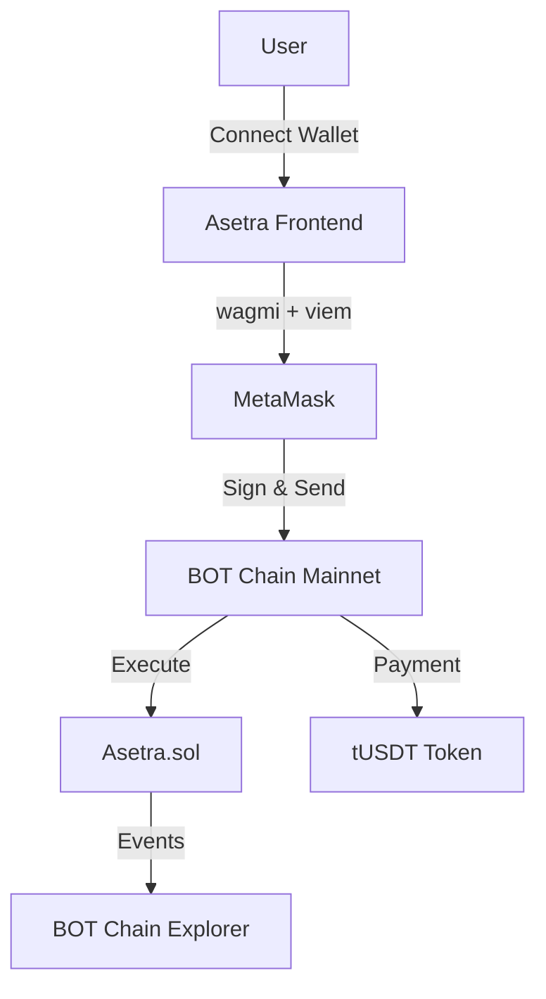
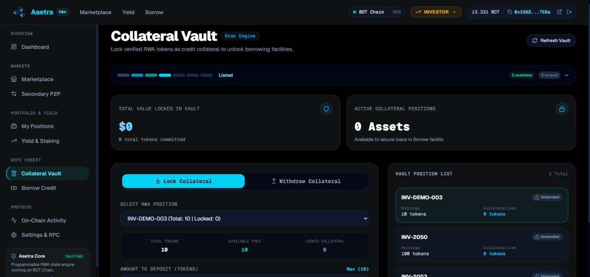
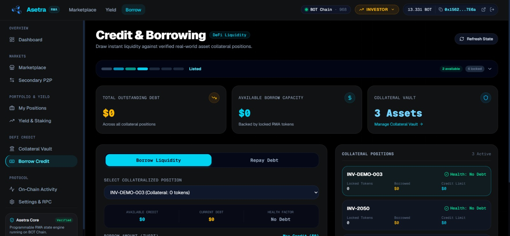

<p align="center">
  
</p>

<h1 align="center">Asetra</h1>

<p align="center">
  <b>Real-world assets, made programmable.</b>
</p>

Asetra is a lifecycle-driven RWA platform that transforms verified real-world assets — such as invoices — into programmable on-chain positions. Instead of stopping at tokenization, Asetra continues the financial lifecycle through investment, trading, yield, collateral, borrowing, maturity, and settlement.

> **Tokenization is only the beginning.**

<p align="center">
  <a href="https://www.asetra-rwa.my.id">Live</a> ·
  <a href="https://scan.botchain.ai/address/0x1893bd849B656fE9eBFf8392340C30FE04268C37">Contract</a> ·
  <a href="https://scan.botchain.ai">BOTScan</a> ·
  <a href="https://github.com/bayuapriansyah/Asetra">GitHub</a>
</p>

---

## Table of Contents

- [Overview](#overview)
- [Problem](#problem)
- [Solution](#solution)
- [Main Feature — Programmable RWA Lifecycle](#main-feature--programmable-rwa-lifecycle)
- [Primary Use Case — Invoice Financing](#primary-use-case--invoice-financing)
- [Demo Flow](#demo-flow)
- [Features](#features)
- [Why Blockchain?](#why-blockchain)
- [Architecture](#architecture)
- [Smart Contract](#smart-contract)
- [Yield Model](#yield-model)
- [Collateral & Borrowing](#collateral--borrowing)
- [Tech Stack](#tech-stack)
- [BOT Chain Configuration](#bot-chain-configuration)
- [Deployment](#deployment)
- [Local Development](#local-development)
- [Testing](#testing)
- [Project Structure](#project-structure)
- [Future Improvements](#future-improvements)
- [Built For](#built-for)

---

## Overview

Most RWA platforms stop at turning an asset into a token. Asetra goes further.

Once a real-world asset is verified and tokenized on-chain, it enters a **programmable financial lifecycle**. Every state transition is enforced by a smart contract. Every financial action — invest, trade, collateralize, borrow, yield, settle — is governed by the asset's current lifecycle state.

The result: a complete on-chain financial workflow for real-world assets, from creation to settlement.

<p align="center">
  
</p>

---

## Problem

### Tokenization is not enough

Creating a token representing a real-world asset does not automatically provide:

- Investment and financing
- Secondary market liquidity
- Collateral utility
- Borrowing capacity
- Yield generation
- Maturity enforcement
- Settlement

### Fragmented RWA lifecycle

In practice, document processing, verification, financing, trading, lending, and settlement exist as disconnected systems. There is no single on-chain workflow connecting them.

### Poor asset state visibility

Investors need to know: Is this asset verified? Funded? Active? Mature? Settled? Without clear lifecycle states, users cannot understand what actions are available or what the asset's financial status is.

---

## Solution

Asetra models each real-world asset as a **lifecycle state machine**:

```text
REAL-WORLD ASSET
      ↓
   CREATE
      ↓
   VERIFY
      ↓
  TOKENIZE
      ↓
    LIST
      ↓
   INVEST
      ↓
POSITION
  ↙   ↓   ↘
TRADE YIELD COLLATERAL
              ↓
            BORROW
              ↓
            REPAY
              ↓
           MATURITY
              ↓
          SETTLEMENT
```

**The current state determines which financial actions are available.** Invalid transitions are rejected on-chain.

---

## Main Feature — Programmable RWA Lifecycle

The lifecycle is a smart contract state machine, not just a frontend visualization:

```text
CREATED
   ↓
VERIFIED
   ↓
TOKENIZED
   ↓
LISTED
   ↓
FUNDED
   ↓
ACTIVE
   ↓
MATURED
   ↓
SETTLED
```

Each state transition is enforced on-chain. For example:

- `CREATED → SETTLED` is **invalid** and will revert.
- `LISTED → ACTIVE` only happens automatically when funding target is met.

<p align="center">
  
</p>

### State-Based Actions

| State | Who Can Act | Available Actions |
|-------|-------------|-------------------|
| `CREATED` | Admin | Verify asset |
| `VERIFIED` | Issuer | Tokenize (set supply + price) |
| `TOKENIZED` | Issuer | Publish to marketplace |
| `LISTED` | Investor | Buy tokens (pay tUSDT) |
| `FUNDED` | — | Auto-advances to ACTIVE |
| `ACTIVE` | Investor + Issuer | Trade, yield, collateral, borrow, repay, mature |
| `MATURED` | Issuer | Complete settlement |
| `SETTLED` | — | Lifecycle closed |

### Role System

| Role | Capabilities |
|------|-------------|
| **Admin** | Verify assets, monitor protocol |
| **Issuer** | Create, tokenize, list, mature, settle assets |
| **Investor** | Buy tokens, trade P2P, collateralize, borrow, claim yield |

> **⚠️ Role Switcher — demo convenience only**
>
> You can switch Admin / Issuer / Investor freely at any time — no login, no permission
> gate. One wallet plays every role end-to-end so the full demo flow can be run solo.
> This is intentionally **not** a production access-control model: real authorization is
> enforced on-chain by the smart contract (`onlyAdmin`, issuer-ownership checks), so
> changing the UI role never grants capabilities your wallet doesn't hold on-chain.

---

## Primary Use Case — Invoice Financing

```text
Invoice #INV-2050
Issuer:    0x1562...7E6a
Face Value: $50
Yield:     8.2% APY
Supply:    100 tokens
Price:     $0.50 / token
```

**Business flow:**

1. Issuer has a $50 invoice due in 30 days
2. Instead of waiting, issuer tokenizes it into 100 tokens at $0.50 each
3. Investors buy tokens → issuer gets immediate liquidity
4. Investors earn 8.2% APY yield while holding
5. Investors can use tokens as collateral to borrow tUSDT
6. At maturity, issuer settles and lifecycle closes

---

## Demo Flow

Watch an asset come alive.

```text
[1] Issuer:   Create Asset (face value, yield, maturity, doc hash)
       ↓
[2] Admin:    Verify Asset (onlyAdmin)
       ↓
[3] Issuer:   Tokenize (set token supply → price auto-calculated)
       ↓
[4] Issuer:   Publish to Marketplace (state → LISTED)
       ↓
[5] Investor: Buy Tokens (approve tUSDT → buyTokens → position created)
       ↓            ↓
       ↓      [Auto: FUNDED → ACTIVE when target met]
       ↓
[6] Investor: Deposit Collateral (lock tokens as collateral)
       ↓
[7] Investor: Borrow tUSDT (up to 60% LTV of collateral)
       ↓
[8] Investor: Repay loan (approve tUSDT → repay)
       ↓
[9] Investor: Create Sell Order (secondary market P2P)
       ↓
[10] Investor 2: Buy from Sell Order
       ↓
[11] Investor: Claim Yield (accrues daily: invest × yieldBps / 365 × days)
       ↓
[12] Issuer:  Mature Asset (after due date)
       ↓
[13] Issuer:  Complete Settlement (lifecycle closes)
```

> **Note:** The demo runs on a single wallet with freely switchable UI roles — pure
> demo convenience. All authorization is enforced by the smart contract, not the UI.

<p align="center">
  
</p>

Every transaction is recorded on BOT Chain and verifiable on the explorer.

---

## Features

| Feature | Status | Description |
|---------|--------|-------------|
| RWA Registry | ✅ | Create and store asset metadata on-chain |
| Verification | ✅ | Admin-only verification with on-chain audit trail |
| Tokenization | ✅ | Configurable token supply, auto-calculated price per unit |
| Marketplace | ✅ | Browse listed assets with lifecycle status |
| Investment | ✅ | Buy tokens with tUSDT, position tracking |
| Portfolio | ✅ | View all investment positions |
| Lifecycle Engine | ✅ | 8-state machine enforced by smart contract |
| Trading P2P | ✅ | Create/cancel sell orders, execute trades |
| Collateral | ✅ | Deposit/withdraw with 60% max LTV enforcement |
| Borrowing | ✅ | Borrow against collateral, health factor monitoring |
| Yield | ✅ | Time-based yield accrual, claim to wallet |
| Maturity | ✅ | Issuer-triggered after due date |
| Settlement | ✅ | Lifecycle closure with principal + yield event |
| Activity Log | ✅ | On-chain event history |
| Role-Based UI | ✅ | Admin / Issuer / Investor with route protection |

---

## Why Blockchain?

Asetra uses blockchain as the execution and source-of-truth layer for financial state.

### On-chain

- Asset lifecycle state machine
- Ownership and position accounting
- Investment and payment flow
- Secondary market trading
- Collateral locks and LTV enforcement
- Debt tracking and repayment
- Yield accrual state
- Maturity and settlement

### Off-chain

- Document storage and hash verification
- UI presentation and routing
- Wallet interaction (MetaMask)

Blockchain does not independently verify whether a physical invoice is authentic. Verification is a controlled step performed by the admin before the asset enters its on-chain lifecycle. The smart contract then enforces all financial state transitions.

---

## Architecture



| Layer | Responsibility |
|-------|---------------|
| **Frontend** | UI, routing, wallet connection, transaction handling |
| **wagmi + viem** | Web3 provider, contract reads/writes, transaction receipts |
| **MetaMask** | Wallet, signing, broadcasting |
| **BOT Chain** | EVM execution, state storage, event emission |
| **Asetra.sol** | Lifecycle logic, access control, financial operations |
| **tUSDT** | ERC-20 payment token (6 decimals) |

---

## Smart Contract

**Asetra** — Single contract managing all assets, positions, and financial operations.

### Lifecycle Functions

| Function | Access | Description |
|----------|--------|-------------|
| `createAsset()` | Issuer | Register new RWA with metadata |
| `verifyAsset()` | Admin | Mark asset as verified |
| `tokenizeAsset()` | Issuer | Set token supply, calculate price |
| `listAsset()` | Issuer | Publish to marketplace |
| `buyTokens()` | Investor | Purchase tokens with tUSDT |
| `matureAsset()` | Issuer | Transition to MATURED (after due date) |
| `settleAsset()` | Issuer | Close lifecycle |

### Financial Functions

| Function | Access | Description |
|----------|--------|-------------|
| `createSellOrder()` | Investor | List tokens on secondary market |
| `cancelSellOrder()` | Seller | Cancel active sell order |
| `executeTrade()` | Buyer | Buy from sell order |
| `depositCollateral()` | Investor | Lock tokens as collateral |
| `withdrawCollateral()` | Investor | Release collateral (LTV check) |
| `borrow()` | Investor | Borrow tUSDT against collateral |
| `repay()` | Investor | Repay borrowed tUSDT |
| `claimYield()` | Investor | Claim accrued yield |
| `recordPayment()` | Admin | Record real-world cashflow evidence |
| `fundSettlement()` | Anyone | Fund settlement pool with tUSDT |
| `claimProceeds()` | Investor | Claim paid proceeds (capped by pool) |
| `withdrawRaisedFunds()` | Issuer | Withdraw raised investment capital |

### View Functions

| Function | Returns |
|----------|---------|
| `getPosition()` | amount, totalInvested, holdingStart, yield, collateral |
| `getHealth()` | healthFactor, healthy (bool) |
| `getAvailableUnits()` | Remaining token supply |
| `getAvailableCredit()` | Max borrowable amount |
| `getHoldingScore()` | Units × holding days |
| `getSellOrder()` | Order details |

### Events

`AssetCreated` · `AssetVerified` · `AssetTokenized` · `AssetListed` · `InvestmentMade` · `SellOrderCreated` · `SellOrderCancelled` · `TradeExecuted` · `CollateralDeposited` · `CollateralWithdrawn` · `Borrowed` · `Repaid` · `YieldClaimed` · `AssetMatured` · `AssetSettled`

---

## Yield Model

```text
yield = (totalInvested × yieldBps / 10,000) / 365 × daysHeld
```

- **Simple annual calculation** (not compound)
- Yield accrues daily based on holding duration
- Minimum 1 day holding required for claimable yield
- Claimable anytime (does not require maturity)

---

## Collateral & Borrowing

Turn idle RWA positions into liquidity without selling them.

**Flow:**

1. **Deposit** — lock position tokens in the Collateral Vault
2. **Credit capacity** — each position unlocks borrowable tUSDT (60% max LTV)
3. **Borrow** — draw tUSDT up to available credit, live on the Credit & Borrowing page
4. **Health factor** — monitored continuously; unhealthy positions can't withdraw collateral
5. **Repay** — repaying debt releases the locked collateral

<p align="center">
  
</p>

```text
creditCapacity = collateralValue × 60%    (max LTV = 60%)

healthFactor = (collateralValue × 10,000) / (borrowed × 60)
healthy = healthFactor ≥ 100
```

<p align="center">
  
</p>

---

## Tech Stack

| Layer | Technology |
|-------|-----------|
| Framework | Next.js 16.3.5 |
| UI | React 19.2.8 |
| Language | TypeScript |
| Styling | Tailwind CSS v4 |
| Icons | Lucide React |
| Animation | Framer Motion |
| Charts | Recharts |
| PDF | pdfjs-dist |
| Web3 | wagmi 3.7.7 + viem 2.56.5 |
| Wallet | MetaMask |
| Smart Contract | Solidity 0.8.20 |
| Contract Tooling | Foundry |
| Blockchain | BOT Chain Mainnet |
| Payment Token | tUSDT (6 decimals) |

---

## BOT Chain Configuration

| Parameter | Value |
|-----------|-------|
| Network | BOT Chain Mainnet |
| Chain ID | 677 |
| RPC | `https://rpc.botchain.ai` |
| Explorer | `https://scan.botchain.ai` |
| Faucet | `https://faucet.botchain.ai/basic` |
| Native Token | BOT |

Testnet is also supported (Chain ID 968, RPC `https://rpc.bohr.life`, Explorer `https://scan.bohr.life`).

---

## Deployment

### Testnet (BOT Chain Testnet)

| Property | Value |
|----------|-------|
| Network | BOT Chain Testnet |
| Contract | Asetra.sol |
| Address | `0x13630987Dc4E86277204ED23a98a95D9D3f927bE` |
| tUSDT | `0x75edC9335175Fc0552D51D48439F229c10420fe3` |
| Explorer | [View on BOTScan](https://scan.bohr.life/address/0x13630987Dc4E86277204ED23a98a95D9D3f927bE) |

### Mainnet (BOT Chain Mainnet)

| Property | Value |
|----------|-------|
| Network | BOT Chain Mainnet (Chain ID 677) |
| Contract | Asetra.sol |
| Address | `0x1893bd849B656fE9eBFf8392340C30FE04268C37` |
| tUSDT | `0xaBabc7Ddc03e501d190C676BF3d92ef0e6e87a3C` |
| Explorer | [View on BOT Scan](https://scan.botchain.ai/address/0x1893bd849B656fE9eBFf8392340C30FE04268C37) |

### Deployment Workflow

```text
Asetra.sol
    ↓
Foundry (compile + test)
    ↓
forge create (deploy via CLI)
    ↓
BOT Chain Testnet / Mainnet
    ↓
Contract Address
    ↓
web/.env.local (NEXT_PUBLIC_ASETRA_ADDRESS)
    ↓
Frontend reads contract
```

---

## Local Development

### Prerequisites

- Node.js v18+
- MetaMask browser extension
- BOT Chain Mainnet added to MetaMask

### Frontend

```bash
git clone https://github.com/bayuapriansyah/Asetra.git
cd Asetra/web
npm install
npm run dev
```

### Smart Contract

```bash
cd contracts
forge build
forge test
```

### Environment Variables

Create `web/.env.local`:

```env
NEXT_PUBLIC_BOT_CHAIN_ID=677
NEXT_PUBLIC_BOT_RPC_URL=https://rpc.botchain.ai
NEXT_PUBLIC_BOT_EXPLORER_URL=https://scan.botchain.ai
NEXT_PUBLIC_ASETRA_ADDRESS=0x1893bd849B656fE9eBFf8392340C30FE04268C37
NEXT_PUBLIC_TUSDT_ADDRESS=0xaBabc7Ddc03e501d190C676BF3d92ef0e6e87a3C
```

> Never commit `.env.local` with real keys or secrets.

### MetaMask Setup

1. Add BOT Chain Mainnet:
   - Network Name: `BOT Chain`
   - RPC URL: `https://rpc.botchain.ai`
   - Chain ID: `677`
   - Currency Symbol: `BOT`
   - Block Explorer: `https://scan.botchain.ai`
2. Get BOT from [faucet](https://faucet.botchain.ai/basic) or exchange

---

## Testing

### Smart Contract Tests

```bash
cd contracts
forge test
```

```text
Suite result: ok. 40 passed; 0 failed; 0 skipped
```

**Coverage:**

| Category | Tests |
|----------|-------|
| Lifecycle state transitions | ✅ |
| Invalid state reverts | ✅ |
| Access control (admin, issuer) | ✅ |
| Investment + position accounting | ✅ |
| Trading (create, cancel, execute) | ✅ |
| Collateral (deposit, withdraw, LTV) | ✅ |
| Borrowing + repayment | ✅ |
| Yield calculation | ✅ |
| Maturity + settlement | ✅ |
| Payment-Adjusted Receivable Claim (CPI) | ✅ |
| Claim cap at settlement pool | ✅ |
| totalRaised persistence after withdraw | ✅ |

### Frontend Build

```bash
cd web
npm run build
```

All pages compile clean (HTTP 200).

---

## Project Structure

```text
Asetra/
├── contracts/
│   ├── src/
│   │   └── Asetra.sol               # Main smart contract (~680 lines)
│   ├── test/
│   │   └── Asetra.t.sol             # 40 Foundry tests
│   ├── lib/                          # Foundry dependencies
│   └── foundry.toml                  # Solidity 0.8.20, optimizer 200
│
├── web/
│   ├── app/
│   │   ├── page.tsx                    # Landing page
│   │   ├── globals.css                 # Global styles
│   │   └── app/
│   │       ├── page.tsx                # Overview / Dashboard
│   │       ├── marketplace/            # Browse assets
│   │       ├── assets/[id]/            # Asset detail + actions
│   │       ├── portfolio/              # Investment positions
│   │       ├── yield/                  # Yield accrual
│   │       ├── trading/                # Secondary P2P market
│   │       ├── collateral/             # Collateral vault
│   │       ├── borrow/                 # Borrow + repay
│   │       ├── issuer/
│   │       │   ├── create/             # Create new asset
│   │       │   └── assets/             # My offerings
│   │       ├── admin/
│   │       │   └── verify/             # Admin verification
│   │       ├── activity/               # On-chain event history
│   │       └── settings/               # Wallet + network info
│   │
│   ├── components/
│   │   ├── layout/                     # Navbar, Sidebar, AppLayout
│   │   ├── role/                       # RoleSelector, RoleGuard
│   │   └── ui/                         # Skeleton, shared UI
│   │
│   ├── hooks/                          # useBuyTokens, useLifecycle, etc.
│   ├── lib/
│   │   ├── utils/format.ts             # formatUSD, formatBps, etc.
│   │   ├── utils/errors.ts             # parseContractError (hex selector decoding)
│   │   └── context/RoleContext.tsx      # Role state management
│   │
│   ├── config/contracts.ts             # ABI + contract addresses
│   ├── types/asset.ts                  # TypeScript types
│   └── .env.local                      # Environment config
│
└── README.md
```

---

## Future Improvements

- Off-chain document storage + AI extraction
- Multiple RWA asset classes (real estate, trade receivables, equipment)
- Advanced order book with limit orders
- Oracle integration for real-world data feeds
- Production-grade settlement with automatic principal transfer
- Institutional compliance and KYC/AML
- Multi-asset portfolio analytics

---

## Built For

**Girl Meets Tech — Build Week Hackathon Vol.2**

Built on BOT Chain (EVM) · Solidity · Next.js · wagmi · viem · Foundry
